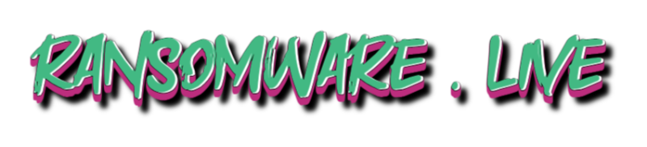

>[chat.ransomware.live](https://chat.ransomware.live) is a website to display ransom chat from [Ransomchats](https://github.com/Casualtek/Ransomchats) json file 

## 🔭 Sources 

- [Valéry Rieß-Marchive](https://twitter.com/ValeryMarchive) for [negotiations chats](https://github.com/Casualtek/Ransomchats)

## 👨🏼‍💼 About me 

I'm **Julien Mousqueton**

- I'm **CTO** in Cyber Security 🛡 
- I'm a **lecturer** 🎓 in Cyber Security @ [Ecole 2600](https://www.ecole2600.com) 🏴‍☠️
- I'm a **blogger** ✍🏻 at [julien.io](https://julien.io) in french 🇫🇷 

You can find more in [my resume](https://cv.julien.io) in English (also available in [French](https://cv.julien.io/fr) / aussi disponible en [français](https://cv.julien.io/fr))

## 🤩 Credits

- [Josh Highet](https://github.com/joshhighet) for the original [ransomwatch](https://github.com/joshhighet/ransomwatch) project. 
- [Valéry Rieß-Marchive](https://twitter.com/ValeryMarchive) for ideas and his involvement in the cyber community.

## 📜 License

ransomwatch is [licensed](https://github.com/jmousqueton/chat.ransomware.live/blob/main/LICENSE) under [MIT](https://opensource.org/license/mit/)
